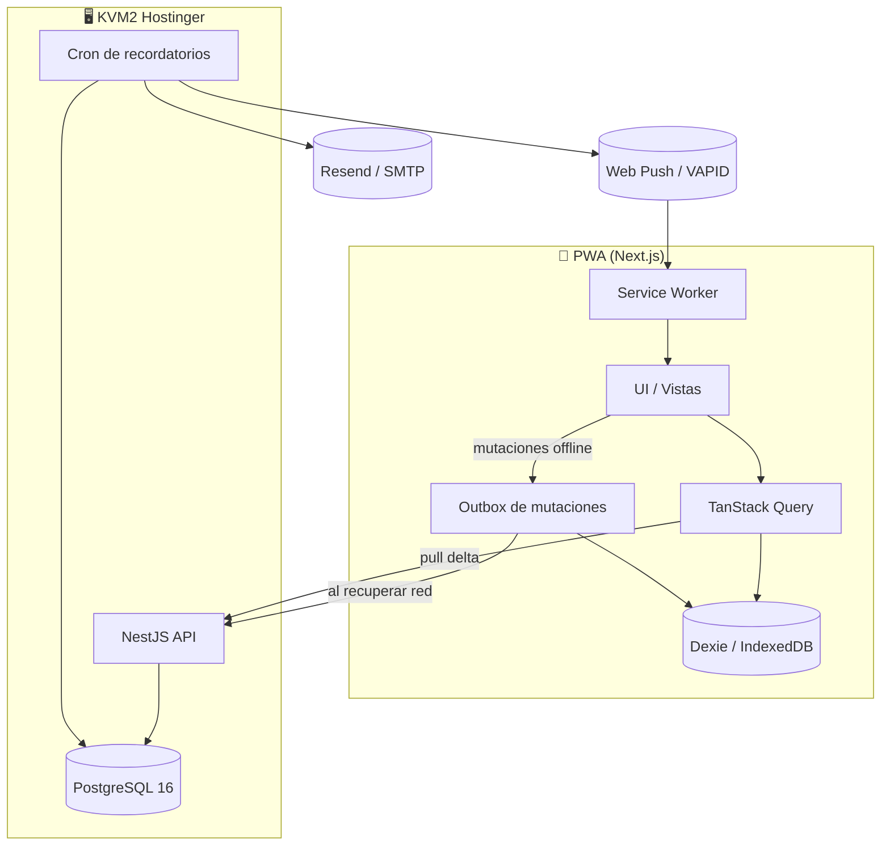
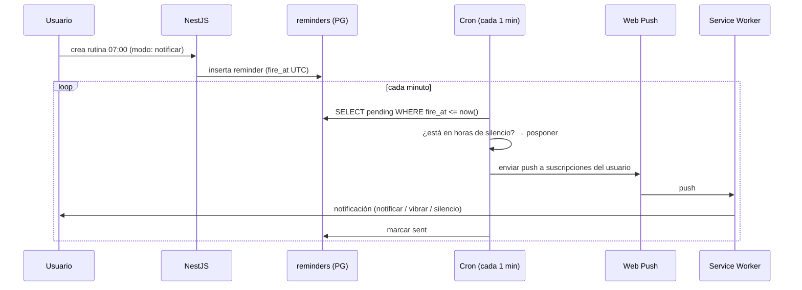

# Mi Centro — Documento de Arquitectura y Stack

> App personal de control: **Finanzas · Rutinas · Dieta**
> PWA · Offline-first · Multi-dispositivo (iPhone + Android) · Notificaciones invasivas
> Documento base para iniciar el desarrollo.

---

## 1. Visión técnica en una frase

Una PWA instalable que funciona sin conexión, guarda todo localmente y sincroniza con un backend propio en tu KVM2 de Hostinger, con un motor de recordatorios que dispara notificaciones push, email e in-app según las reglas de cada elemento.

---

## 2. Stack tecnológico

### Frontend

| Pieza | Elección | Por qué |
|---|---|---|
| Framework | **Next.js 15** (App Router, TypeScript, React 19) | SSR/CSR, PWA-ready, lo dominas |
| UI | **TailwindCSS 4** + **shadcn/ui** | Móvil-first, componentes accesibles, rápido |
| Estado servidor | **TanStack Query v5** | Cache, reintentos, sincronización declarativa |
| Estado local | **Zustand** | Ligero para UI state (filtros, modales, tema) |
| BD local (offline) | **Dexie.js** (IndexedDB) | API simple, queries reactivas, fiable en iOS/Android |
| Recurrencias | **rrule.js** | Genera instancias desde RRULE (RFC 5545) |
| Fechas/zona horaria | **Luxon** | Manejo correcto de timezone (crítico) |
| Formularios | **React Hook Form** + **Zod** | Validación tipada compartida con el backend |
| PWA / SW | **Workbox** + `next-pwa` (o SW manual) | Cache, offline, push, background sync |

### Backend

| Pieza | Elección | Por qué |
|---|---|---|
| Framework | **NestJS 11** (TypeScript) | Modular, escalable, ya lo conoces |
| Runtime | **Node 22 LTS** | Soporte largo plazo |
| ORM | **Drizzle ORM** (recomendado) o **Prisma 6** | Drizzle calza directo con el esquema SQL y es liviano; Prisma si prefieres familiaridad |
| Validación | **Zod** (compartido vía paquete común) | Una sola fuente de verdad cliente/servidor |
| Auth | **Passport JWT** + **argon2** | Access + refresh tokens, hashing fuerte |
| Push | **web-push** (VAPID) | Web Push estándar |
| Cron | **@nestjs/schedule** | Escaneo de recordatorios cada minuto |
| Email | **Resend** (o SMTP de Hostinger) | Refuerzo de alertas críticas |

### Infraestructura (KVM2 Hostinger)

| Pieza | Elección |
|---|---|
| BD | **PostgreSQL 16** |
| Reverse proxy | **Nginx** + **Let's Encrypt** (HTTPS, requisito para PWA/push) |
| Procesos | **PM2** (o Docker Compose si quieres aislar) |
| CI/CD | **GitHub Actions** (build + deploy por SSH) |

> **Decisión clave:** mismo lenguaje (TypeScript) de punta a punta. El paquete `shared` con tipos y esquemas Zod evita desincronización entre front y back.

---

## 3. Arquitectura general



### Capas del backend (NestJS)

```
AuthModule        → registro, login, refresh, guards JWT
UsersModule       → perfil, preferencias (idioma, tema, horas silencio)
FinanceModule     → categorías, movimientos, recurrentes, metas, aportes
RoutinesModule    → rutinas, logs de cumplimiento
DietModule        → platos, ingredientes, plan de comidas
RemindersModule   → cola de recordatorios + cron de disparo
SyncModule        → endpoint de sincronización delta
NotificationsModule → web-push + email + suscripciones
```

---

## 4. Sincronización offline-first

El corazón de la app. Patrón **local-first con outbox**:

1. **Escritura local primero.** Toda creación/edición se guarda en Dexie de inmediato y se encola en una tabla `outbox`. La UI responde al instante (optimista).
2. **IDs en el cliente.** Los UUID se generan en el dispositivo, así no dependes del servidor para tener un ID válido offline.
3. **Push (subir).** Cuando hay red (o vía Background Sync del SW), el outbox envía las mutaciones a `POST /sync/push`. El servidor aplica y devuelve la versión resultante.
4. **Pull (bajar).** El cliente llama `GET /sync/pull?since=<ISO>` y recibe todos los registros con `updated_at > since` de todas las entidades. Dexie los fusiona.
5. **Conflictos.** Estrategia por defecto **last-write-wins** comparando `updated_at`. El campo `version` permite detectar el conflicto; si algún día quieres resolución manual, el servidor puede devolver ambas versiones para que el usuario elija.
6. **Soft-delete.** Nada se borra: se marca `deleted_at`. Así la sincronización propaga borrados y conservas historial para las vistas comparativas.

> Alternativas si más adelante quieres delegar el motor: **PowerSync** o **ElectricSQL** (sync Postgres↔cliente listo para usar). Para empezar, el outbox propio te da control total.

---

## 5. Motor de notificaciones



- **Modos por elemento:** `notify` / `vibrate` / `silent`, configurables por rutina, comida o meta.
- **Horas de silencio globales:** el cron respeta `quiet_hours_start/end` del usuario.
- **Refuerzo:** alertas críticas (ej. meta en riesgo) también por email.
- **In-app:** badge contador + toasts cuando la app está abierta.

> ⚠️ **Límite iOS:** en iPhone el Web Push solo funciona con la PWA **instalada en pantalla de inicio** (iOS 16.4+) y es menos agresivo que una app nativa. Documentado para no generar falsas expectativas.

---

## 6. Autenticación y seguridad

- Registro: **nombre + correo + contraseña** (sin OAuth, como pediste).
- Contraseñas con **argon2**.
- **Access token** (corto, ~15 min) en memoria + **refresh token** (largo) en cookie `httpOnly` + `Secure`.
- Guards JWT en todas las rutas salvo `auth/*`.
- Rate limiting (`@nestjs/throttler`) en login/registro.
- HTTPS obligatorio (Let's Encrypt) — además es requisito para Service Worker y push.
- Cifrado de datos financieros: **no en MVP** (uso personal); previsto para cuando escale.

---

## 7. Diseño de la API (REST)

```
POST   /auth/register
POST   /auth/login
POST   /auth/refresh
GET    /me                         · perfil + preferencias
PATCH  /me                         · idioma, tema, horas silencio

# Finanzas
GET/POST          /categories
GET/POST          /transactions          ?from&to&category&kind
PATCH/DELETE      /transactions/:id
GET/POST/PATCH    /recurring-transactions
GET/POST/PATCH    /goals
POST              /goals/:id/contributions

# Rutinas
GET/POST/PATCH/DELETE  /routines
POST                   /routines/:id/logs   · marcar done/skipped por fecha
GET                    /routines/stats      · % cumplimiento, rachas

# Dieta
GET/POST/PATCH/DELETE  /dishes
GET/POST               /dishes/:id/ingredients
GET/POST/PATCH         /meal-plans          ?date
GET                    /meal-plans/shopping-list ?from&to

# Notificaciones
POST   /push/subscribe
DELETE /push/subscribe

# Sincronización
POST   /sync/push      · sube outbox
GET    /sync/pull?since=<ISO>   · baja delta
```

---

## 8. Estructura de carpetas (monorepo)

```
mi-centro/
├── apps/
│   ├── web/                  # Next.js 15 (PWA)
│   │   ├── app/              # rutas: (auth), hoy, finanzas, rutinas, dieta
│   │   ├── components/       # UI (shadcn) + componentes propios
│   │   ├── lib/
│   │   │   ├── db.ts         # Dexie schema
│   │   │   ├── sync.ts       # outbox + pull/push
│   │   │   └── push.ts       # suscripción web-push
│   │   ├── public/
│   │   │   ├── manifest.json
│   │   │   └── sw.js         # Service Worker (Workbox)
│   │   └── ...
│   └── api/                  # NestJS 11
│       └── src/
│           ├── auth/  users/  finance/  routines/
│           ├── diet/  reminders/  sync/  notifications/
│           └── main.ts
├── packages/
│   └── shared/               # tipos TS + esquemas Zod + helpers RRULE
├── db/
│   └── schema.sql            # esquema PostgreSQL (ya creado)
└── .github/workflows/        # CI/CD
```

---

## 9. Funcionalidades por módulo (alcance de desarrollo)

### 💰 Finanzas
- Registrar ingreso/gasto: monto, categoría, descripción, fecha.
- Categorías configurables (nombre, color, ícono, tipo).
- Movimientos recurrentes (sueldo, arriendo) auto-registrados por RRULE.
- Metas con monto objetivo, fecha y progreso visual.
- Aportes a metas con historial (habilita comparativa).
- Resumen mensual: ingresos vs gastos vs disponible.
- *Reportes avanzados: fase posterior (gasto por categoría, comparativa mes a mes).*

### 📋 Rutinas
- Crear rutina: título + hora + recurrencia (diaria, semanal, días específicos).
- Genera bloque de calendario y recordatorio automático.
- Modo de notificación por rutina (notificar / vibrar / silencio).
- Checklist diario: marcar hecho / saltado.
- Rachas y % de cumplimiento (semanal/mensual).
- Pausar/reactivar sin perder historial.
- Exportar a calendario real (.ics) — opcional.

### 🥗 Dieta
- Catálogo de platos reutilizables (nombre, notas, tiempo de prep).
- Ingredientes por plato (para lista de compras).
- Plan de comidas por día y tipo (desayuno/almuerzo/cena/snack).
- Hora de cocción y de comida configurables.
- **Aviso matutino**: resumen de qué cocinar hoy y a qué hora.
- Checklist: planificado vs comido.
- **Lista de compras automática** desde el plan semanal.

### 📊 Dashboard / Comparativas
- Vista "Hoy": pendientes, comidas, estado de finanzas.
- Vista por fechas: ver cualquier periodo de los 3 módulos.
- Vista comparativa: contrastar periodos (mes vs mes, semana vs semana).

### ⚙️ Transversal
- Autenticación (registro/login).
- Preferencias: idioma (ES/EN), tema (claro/oscuro/sistema), horas de silencio.
- Sincronización offline-first multi-dispositivo.
- PWA instalable.

---

## 10. Roadmap por fases

| Fase | Objetivo | Incluye |
|---|---|---|
| **0 · Setup** | Base lista | Monorepo, BD + esquema, auth, paquete shared, PWA shell, CI/CD |
| **1 · Finanzas MVP** | Ordenar plata | Movimientos, categorías, metas, resumen mensual |
| **2 · Rutinas MVP** | Hábitos | Rutinas + RRULE, checklist, recordatorios básicos |
| **3 · Dieta MVP** | Comidas | Platos, plan diario, aviso matutino, lista de compras |
| **4 · Sync + Push** | Offline + invasivo | Outbox, pull/push delta, motor de recordatorios, web-push |
| **5 · Dashboard** | Visión unificada | Vista hoy, por fechas y comparativa |
| **6 · Pulido** | Producción | Recurrentes auto, .ics, email, i18n completo, reportes |

> Recomendación: **Fase 0 → 1 → 4 parcial (sync básico)** antes de seguir, para que el offline esté en el ADN desde el inicio y no parchearlo después.

---

## 11. Comandos para arrancar

```bash
# Monorepo (pnpm recomendado)
pnpm dlx create-turbo@latest mi-centro
cd mi-centro

# API
cd apps/api && nest new . --skip-git
pnpm add @nestjs/jwt @nestjs/passport passport-jwt argon2 \
         drizzle-orm pg web-push @nestjs/schedule zod

# Web
cd ../web
pnpm create next-app@latest . --ts --tailwind --app
pnpm add @tanstack/react-query dexie zustand rrule luxon \
         react-hook-form @hookform/resolvers zod

# BD (en el KVM2)
psql -U postgres -d mi_centro -f db/schema.sql
```

---

## 12. Próximos artefactos sugeridos

- Esquema Drizzle/Prisma derivado del `schema.sql`.
- Definición OpenAPI de la API.
- Service Worker + `manifest.json` base.
- Implementación de referencia del módulo de sincronización (`sync.ts`).

*Dime cuál quieres y lo desarrollamos.*
